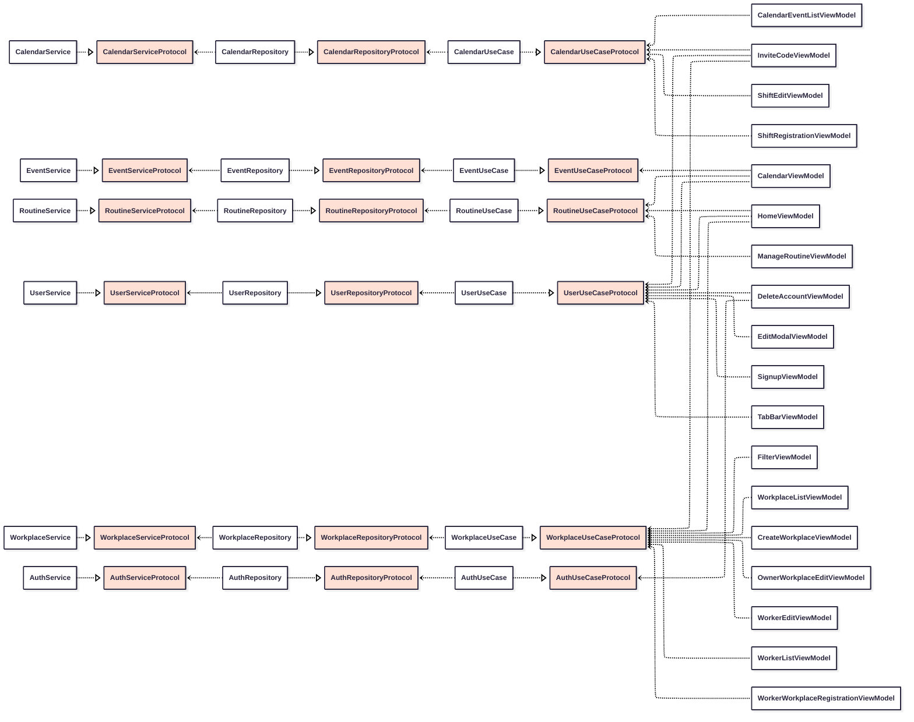
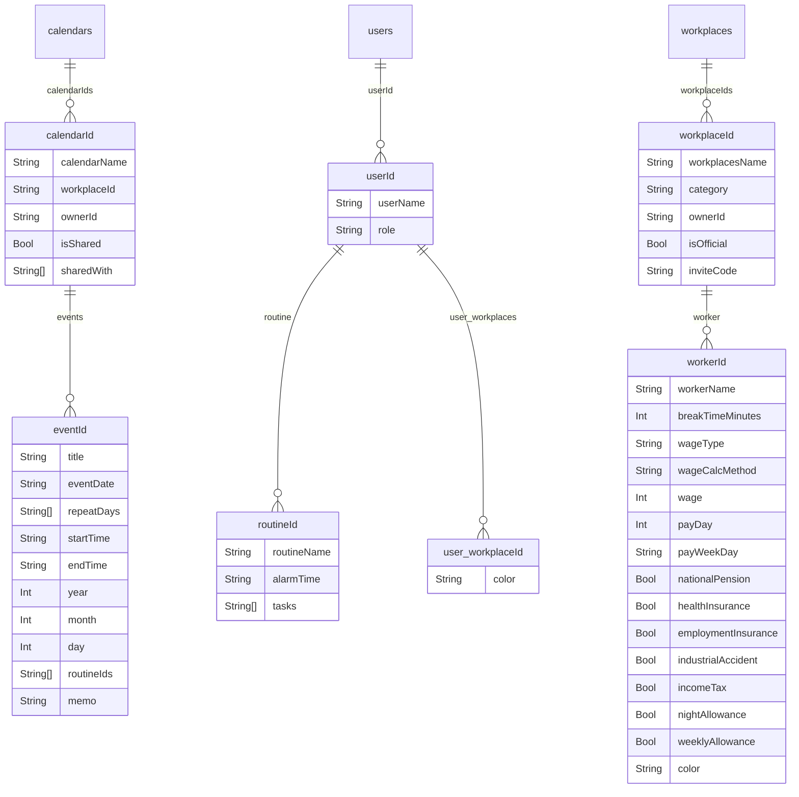

# MOUP


## "모이면 업이 된다 MOUP"
> ***MOUP은 알바생과 사장님이 함께 사용하는 근무 관리 플랫폼입니다.***
> 
> 
> *복잡한 근무 시간 계산과 급여 관리를 간편하게 해결하여*<br>
> *알바생에게는 복잡할 수 있는 근무 시간 • 급여 계산을 돕고, 사장님의 인건비 • 근무 일정의 효율적인 관리를 지원합니다 !*

<br>

<a href="https://apps.apple.com/kr/app/moup/id6747497191">
	
</a>

<br><br>


## 🧑🏻‍💻 구성원 및 역할 분담

### 5rganization

 |  |  |  |  |  
|:----------:|:----------:|:----------:|:----------:|:----------:|:----------:|
| 서동환 | 양원식 | 김신영 | 송규섭 | 신재욱 | 조유빈 |
[GitHub](https://github.com/SNMac) | [GitHub](https://github.com/Sheep1sik) | [GitHub](https://github.com/ksyq12) | [GitHub](https://github.com/SongKyuSeob) | [GitHub](https://github.com/tls427wodnr) |  |

<br>

### 역할 분담

| 이름 | 역할 | 개발 파트 |
|:---------:|:----------:|:----------|
| 서동환 | `리더` | 프로젝트 초기 세팅, Apple 로그인, 캘린더 |
| 양원식 | `부리더` | 파이어베이스 세팅, Data 레이어, Domain 레이어, Google 로그인 |
| 김신영 | `팀원` | 마이페이지, 근무지 등록 Modal, 초대코드를 통한 근무지 등록 |
| 송규섭 | `팀원` | 홈, 급여 계산, 루틴 관리 |
| 신재욱 | `팀원` | 근무지 등록/수정, 근무 등록/수정, 루틴 등록/수정 |
| 조유빈 | `디자이너` | 와이어프레임, UI/UX 디자인 |

<br><br>


## 🔨 개발 환경

 

<br><br>


## 📋 주요 기능
- 시연 영상

[](https://youtube.com/shorts/sKyvHlRNo44)

<br>

<details>
<summary> 급여, 인건비 계산 </summary>
<div markdown="1">


> **급여/인건비 계산**
>
> - 근무지 등록시 해당 근무지에 대한 시급/고정급을 입력하면 실제 근무한 시간에 맞춰 자동으로 급여/인건비를 계산합니다.
> - (알바생) 한 근무지에서 이번달 오늘까지 번 돈과 모든 근무지에서 총 급여를 계산하여 제공합니다.
> - (사장님) 나의 매장에 속한 알바생들 각각의 인건비, 총 인건비를 계산하여 제공합니다.

<br>
</details>

<details>
<summary> 개인/공유 캘린더 </summary>
<div markdown="1">


> **개인/공유 캘린더**
>
> - 개인 캘린더는 사용자가 언제 근무가 있는지, 해당 근무의 급여는 얼마인지 보여주는 캘린더 입니다.
> - 공유 캘린더에선 근무지/매장마다 근무하는 모든 인원의 근무 일정을 알 수 있습니다.
> - 필터 기능을 통해 사용자가 원하는 근무지의 일정만 선택하여 보는것이 가능합니다.

<br>
</details>

<br><br>


## 🛠️ 기술 스택

| 범위 | 기술 이름 |
|:---------:|:----------|
| 의존성 관리 도구 | `SPM`, `CocoaPods` |
| 형상 관리 도구 | `GitHub`, `Git` |
| 아키텍처 | `MVVM`, `Clean Architecture` |
| 디자인 패턴 | `Singleton`, `Delegate` |
| 인터페이스 | `UIKit` |
| 비동기 처리 | `RxSwift`, `RxCocoa`, `RxDataSources` |
| UI 라이브러리 | `JTAppleCalendar`, `BetterSegmentedControl` |
| 레이아웃 구성 | `SnapKit`, `Then` |
| 내부 저장소 | `UserDefaults` |
| 외부 저장소 | `Cloud Firestore` |
| 외부 인증 | `Firebase Auth`, `Sign in with Apple`, `Goolge Sign in` |
| 코드 컨벤션 | `StyleShare - Swift Style Guide` |
| 커밋 컨벤션 | `Udacity Git Commit Message Style Guide` |

<br><br>


## 🤔 기술적 의사결정
<details>
<summary> <b>MVVM</b>, <b>Clean Architecture</b>: 각 계층간의 책임을 분리하고, 의존성을 최소화 및 UseCase의 재사용성을 높임 </summary>	
<div markdown="1">

- 문제 상황
  - 하나의 화면 수정 시 다양한 책임들이 얽혀 코드 변경 범위가 커짐. 비즈니스 로직, 네트워크 처리, 상태 관리, UI 처리가 모두 강하게 결합되는 문제가 발생
- MVVM과 Clean Architecture를 도입하여 View는 UI 처리만 담당, 상태 관리는 ViewModel에서, 비즈니스 로직을 UseCase, Repository, Data Layer로 완전히 분리
- 장점
  - 레이어 간 인터페이스를 명확히 하여 의존성 주입이 쉬운 구조로 개발
  - 역할을 분리하여 책임이 명확해지고 깔끔한 코드 작성 가능
  - 새로운 기능을 도입하거나 교체해도 도메인 로직에 영향 없음
  - ViewModel은 UseCase에만 의존하기 때문에 앱의 핵심 로직 추상화 가능
  - 상위 계층(Presentation)이 하위 계층(Data)의 구현체가 아니라 추상 타입에 의존하여 구체적인 구현을 몰라도 되는 구조
  - 인터페이스(Protocol)를 가운데에 두고, 상위 계층과 하위 계층이 인터페이스를 바라보기 때문에 의존성 역전이 발생함

</details>

<details>
<summary> <b>SwiftUI</b> vs <b>JTAppleCalendar</b> </summary>
<div markdown="1">
	
- 캘린더의 구현 방법을 정할 때 SwiftUI와 외부 라이브러리 사이에서 고민
- UIKit+RxSwift의 일관성과 커스텀 자유도를 높이기 위해 JTAppleCalendar 채택

</details>

<details>
<summary> <b>SPM</b> vs <b>CocoaPods</b> </summary>
<div markdown="1">

- CocoaPods만 지원하는 라이브러리인 JTAppleCalendar를 도입할 때 SPM과 CocoaPods를 혼용할지, CocoaPods로 모든 라이브러리를 통합할지 고민
- SPM이 갖는 이점인 Xcode와 통합된 환경, 빠른 빌드 시간을 가져가기 위해 JTAppleCalendar만 별도로 CocoaPods로 관리
	
</details>


<details>
<summary> <b>RxSwift</b>, <b>RxCocoa</b>, <b>RxDataSources</b>: 비동기 데이터 흐름을 효율적으로 처리하고, 사용자 인터페이스가 데이터 상태에 따라 자연스럽게 반응하도록 구현하기 위해 사용 </summary>
<div markdown="1">

- Input 구조체는 다양한 사용자 이벤트를 Observable 형태로 받아 이벤트 흐름을 선언형으로 정의하고 각각의 반응을 명확하게 구분
- ViewModel 내부 상태는 Relay로 관리하여 UI에 필요한 데이터를 보존하고, 외부에서는 `.asObservable()`로 안전하게 구독하여 View와 단방향 바인딩 가능
- `transform()` 메서드 내부에서 `.flatMap` 등 다양한 연산자를 사용해 이벤트 흐름을 구성하고 코드의 가독성과 유지보수성 향상 가능. 비동기 데이터 흐름과 에러처리, 사이드 이펙트 처리 가능
- Output으로 정의한 데이터를 View에서는 UI만 반응하게 하여 상태 변화와 UI 이벤트 처리 분리 가능
	
</details>

<details>
<summary> <b>Cloud Firestore</b>: 백엔드 구현 없이 사용자가 입력한 근무지/매장 정보, 근무 정보를 DB에 저장하기 위해 사용 </summary>
<div markdown="1">
	
- 의사결정 당시 팀 내 상황
  - 짧은 일정으로 빠른 MVP 개발 및 배포를 진행하고 유저 테스트를 거쳐 앱 업데이트를 목표로 삼음
- 도입시 장점
  - Firestore는 문서(document)와 컬렉션(collection) 구조로 되어 있어 유연한 데이터 모델링 가능
  - 로그인/인증과 연동이 필요했고 팀원 모두가 동시에 접근하고 협업 가능한 구조 필요
  - 따로 백엔드를 관리하거나 서버 인프라를 관리하지 않아도 되고, 콘솔에서 바로 데이터 확인/수정 가능
 
 </details>

**Firebase Auth**, **Google Auth SDK**, **Apple Auth SDK**: 구글, 애플 로그인 기능을 지원하고, 이를 통한 인증을 통합하여 처리


**BetterSegmentedControl**: 커스터마이징이 자유로운 iOS 스타일 세그먼트 컨트롤 컴포넌트


**UserDefaults**: 앱 설치 이후 최초 실행인지 확인하고, 최초 실행인 경우 사용 안내 이미지를 표시하기 위해 사용


**SnapKit**: Auto Layout을 보다 직관적이고 간결하게 작성하기 위해 사용


**Then**: 초기화 직후 속성 설정을 간결하게 작성할 수 있는 라이브러리

<br><br>


## 📊 다이어그램

### 의존성 다이어그램



<br>

### ERD



<br><br>


## 🔧 트러블 슈팅

<details>
<summary> <b>Firebase Listener와 RxSwift timeout 동작 간 충돌</b> </summary>
<div markdown="1">

### 문제 상황
- 홈 화면 데이터 로딩 시 `combineLatest` 사용 중 `timeout` 에러가 지속적으로 발생
    - 첫 데이터 로딩은 성공하지만 5초 후 sequence timeout이 반복 발생

 ### 원인 분석

- Firebase Listener와 RxSwift timeout의 동작 방식이 충돌함
    - 기존 단순 Observable 방식에서 실시간 Listener 기반으로 변경되면서 문제가 발생
    - Listener는 지속적으로 감시하는 방식이라 `timeout`이 매번 초기화되는 특성을 가짐
``` Swift
routineUseCase.fetchTodayRoutineEventsGroupedByWorkplace(uid: userId, date: Date())
    .timeout(.seconds(5), scheduler: MainScheduler.instance)
```
- Listener가 첫 방출 후에도 계속 감시하여 timeout 재시작됨 ➡️ combineLatest 스트림 중단 ➡️ 새로고침 버튼 무효화

### 해결 방안

- Firebase Listener의 지속적 감시 특성을 이해하고 timeout 전략을 수정
- 일회성 API 호출과 지속적 감시의 차이점을 고려한 구현이 필요
``` Swift
routineUseCase.fetchTodayRoutineEventsGroupedByWorkplace(uid: userId, date: Date())
    .catchAndReturn([:])
```

<br>
</details>

<details>
<summary> <b>DisposeBag으로 인한 onNext 미방출 현상</b> </summary>
<div markdown="1">

### 문제 상황

``` Swift
Observable.create { observer in
    // ...
}
.subscribe(onNext: { value in
    print(value)
})
.disposed(by: DisposeBag()) // 잘못된 사용: disposeBag이 즉시 해제되어 스트림이 바로 dispose됨
```

- `Observable.create` 내부에서 `subscribe` 뒤에 `disposed(by: DisposeBag())`을 사용했을 때, `onNext`가 정상적으로 호출되지 않거나 데이터가 반환되지 않는 문제가 발생.
- 실제로 외부에서 아무런 데이터를 받을 수 없는 현상.

### 원인 분석

- `subscribe`할 때마다 새로운 `DisposeBag()`을 생성해서 사용하면, 해당 DisposeBag의 라이프사이클이 subscribe와 동시에 끝남.
- Observable이 값을 방출하기도 전에 스트림이 dispose되어, 중간에 스트림이 끊김.
- 즉, Observable의 방출이 시작되기도 전에 구독이 해제(dispose)되어 onNext가 호출되지 않음.

### 해결 방안

- **Observable.create 내부에는 DisposeBag을 사용하지 않는다.**
- 클래스 레벨의 disposeBag(예: `self.disposeBag`)을 활용한다.
- 서비스 계층이 매번 새로 생성되는 경우, subscribe 뒤에 disposeBag 사용을 금지한다.
- ViewModel이나 ViewController 등 외부에서 Observable을 구독할 때만 disposeBag을 관리하는 방식을 적용한다.

<br>
</details>

<details>
<summary> <b>Firebase Listener와 RxSwift timeout 동작 간 충돌</b> </summary>
<div markdown="1">

### 문제 상황

- 애플 로그인 구현 과정에서 appleIDToken, nonce, credential을 Observable로 반환 시도
    - `ASAuthorizationControllerDelegate` 를 통해서만 이 값들을 받을 수 있어 Rx 적용에 어려움을 느낌

### 원인 분석

- Delegate 패턴으로 작성되어있어 메인 코드가 작성된 곳과 다른 scope에 값이 전달됨
- Service 계층에서 일관적으로 Observable로 반환하는 코드를 유지하기 위해선 Rx스타일로 개선 필요

### 해결방안

- `DelegateProxy` 사용
``` Swift
import Foundation
import AuthenticationServices
import RxCocoa
import RxSwift

extension ASAuthorizationController: @retroactive HasDelegate {}

final class RxASAuthorizationControllerDelegateProxy: DelegateProxy<ASAuthorizationController, ASAuthorizationControllerDelegate>, DelegateProxyType, ASAuthorizationControllerDelegate {
    
    weak public private(set) var authController: ASAuthorizationController?
    
    public init(authController: ParentObject) {
        self.authController = authController
        super.init(parentObject: authController, delegateProxy: RxASAuthorizationControllerDelegateProxy.self)
    }
    
    static func registerKnownImplementations() {
        register { RxASAuthorizationControllerDelegateProxy(authController: $0) }
    }
}

public extension Reactive where Base: ASAuthorizationController {
    var delegate: DelegateProxy<ASAuthorizationController, ASAuthorizationControllerDelegate> {
        RxASAuthorizationControllerDelegateProxy.proxy(for: base)
    }
    
    func setDelegate(_ delegate: ASAuthorizationControllerDelegate) -> Disposable {
        RxASAuthorizationControllerDelegateProxy.installForwardDelegate(delegate,
                                                                        retainDelegate: false,
                                                                        onProxyForObject: self.base)
    }
    
    var didCompleteWithAuthorization: Observable<ASAuthorizationCredential> {
        return delegate.methodInvoked(#selector(ASAuthorizationControllerDelegate.authorizationController(controller:didCompleteWithAuthorization:)))
            .map { parameters in
                return (parameters[1] as! ASAuthorization).credential
            }
    }
}
```
- 적용 코드
``` Swift
authController.rx.didCompleteWithAuthorization.asObservable()
    .subscribe(with: self) { owner, credential in
        if let appleIDCredential = credential as? ASAuthorizationAppleIDCredential {
            guard let nonce = owner.currentNonce else {
                fatalError("Invalid state: A login callback was received, but no login request was sent.")
            }
            guard let appleIDToken = appleIDCredential.identityToken else {
                owner.logger.error("Unable to fetch identity token")
                return
            }
            guard let idTokenString = String(data: appleIDToken, encoding: .utf8) else {
                owner.logger.error("Unable to serialize token string from data: \(appleIDToken.debugDescription)")
                return
            }
            // Initialize a Firebase credential, including the user's full name.
            let credential = OAuthProvider.appleCredential(withIDToken: idTokenString, rawNonce: nonce, fullName:
appleIDCredential.fullName)
            observer.onNext((idTokenString, nonce, credential))
            observer.onCompleted()
        }
    }.disposed(by: disposeBag)
```
- `DelegateProxy`를 사용하여 `ASAuthorizationControllerDelegate` 메서드를 RxSwift 방식으로 사용할 수 있도록 구현
    - `DelegateProxy`는 Delegate를 사용하는 프레임워크와 RxSwift 사이의 다리 역할
    - Delegate 패턴을 Rx스타일로 일관적이게 구현할 수 있도록 해줌

> Rx를 지원하지 않아 Delegate를 사용했던 다른 라이브러리도 `DelegateProxy`를 사용하여 리팩토링 예정

<br>
</details>

<br><br>
